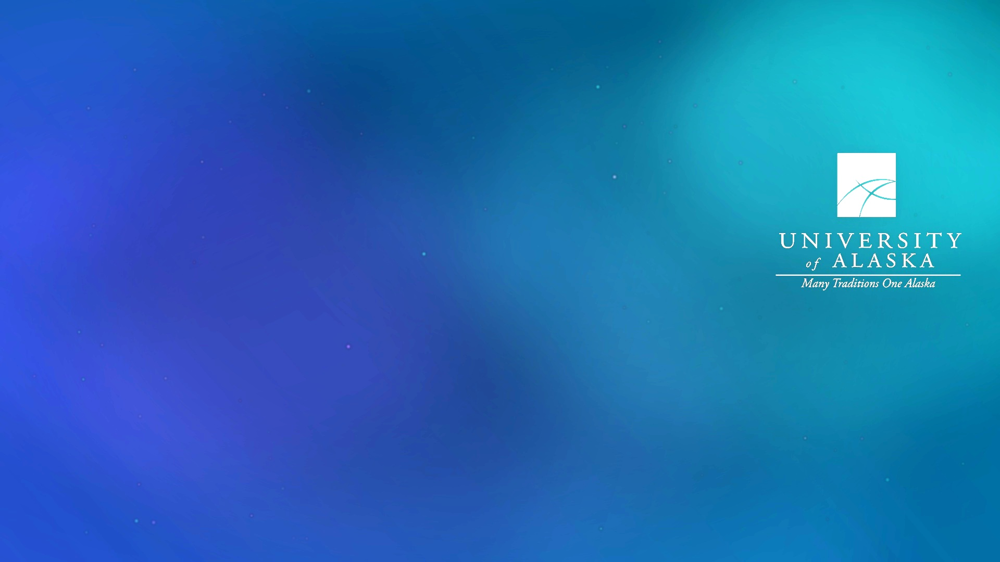
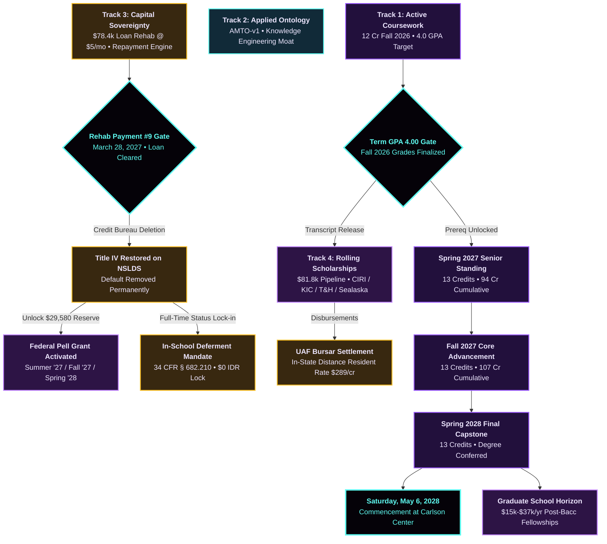

<div align="center">
  

  <h1>🏛️ sovereignCritical // Jeremiah D. Stack</h1>

  <p>
    <strong>Authoritative Master Critical Path, Multi-Track Sovereignty Engine &amp; Formal Applied Ontology</strong><br>
    <em>University of Alaska Fairbanks (Troth Yeddha' Campus) &bull; Bachelor of Arts in Philosophy (Catalog 2025–2026)</em><br>
    <em>Formal Ontology, Mathematical Logic &amp; Knowledge Engineering Specialization</em>
  </p>

  <p>
    <a href="https://thrymspire.github.io/sovereignCritical/"></a>
    <a href="https://github.com/thrymspire/sovereignCritical"></a>
    <a href="#-academic-trajectory--degree-works-matrix-39-credits-to-graduation"></a>
    <a href="#-demographics-invariants--financial-architecture"></a>
    <a href="#-track-3-capital-sovereignty-student-loan-portfolio--9-month-rehabilitation"></a>
    <a href="#-federal-pell-grant-restoration-400-lifetime-eligibility-reserve"></a>
    <a href="#-track-4-continuous-rolling-scholarships--graduate-funding-horizon"></a>
    <a href="#-institutional-covenants-sovereign-financial-goals--semester-gpa-milestones"></a>
    <a href="#-academic-trajectory--degree-works-matrix-39-credits-to-graduation"></a>
    <a href="#-track-2-applied-formal-ontology--enterprise-knowledge-engineering"></a>
  </p>
</div>

---

## 🌟 Personal Statement of Intent & Sovereign Mission Manifesto

> *"Sovereignty is neither given nor assumed; it is engineered. True intellectual and economic independence is erected step by step through rigorous discipline, mathematical truth, cultural heritage, and institutional mastery. The discipline of today constructs the sovereignty of tomorrow."*
> 
> — **Jeremiah D. Stack**

### The Shift from Hope to Mathematical Grounding
`sovereignCritical` represents a deliberate, irreversible transition in my life and academic career: **moving from vulnerable hopes and uncertain dreams to an immovable institutional platform of sovereignty.**

As a proud citizen of the **Central Council of Tlingit & Haida Indian Tribes of Alaska (CCTHITA)**, an enrolled tribal citizen of the **Ketchikan Indian Community (KIC)**, and a lineal descendant tied to **Sealaska Corporation** and **The CIRI Foundation**, my academic mission at the **University of Alaska Fairbanks** is grounded in the conviction that formal logic, applied ontology, and sovereign self-determination are unified expressions of the same truth.

Every single milestone, dollar, deadline, and prerequisite in this repository is governed by the **Zero Assumed Numbers Directive**:
1. **No future funding is taken for granted** without verified, actionable proof of work.
2. **Every debt obligation is confronted directly** through federal statutory rehabilitation (HEA § 428F) and proactive administrative deferment.
3. **Every grade earned is an institutional unlock gate** (4.00 Term GPA / 3.50+ Cumulative Honors Gate) that triggers transcript release, releases tribal grant disbursements, and unlocks federal entitlements.
4. **All scholarship application windows are engineered as continuous rolling pipelines**, sustaining funding across every undergraduate semester and naturally graduating into prestigious post-baccalaureate fellowships.

This repository is my public oath, my operational cockpit, and my technical architecture.

---

## 🧭 Executive Architecture & The 4 Sovereign Tracks

The architecture of `sovereignCritical` synchronizes a canonical 259-task relational ledger with 376 directed causal dependency edges across 4 core operational tracks spanning from **August 24, 2026 through September 4, 2028**:



---

### 📚 Track 1: Active Coursework & Academic Grade Gates
* **Current Term (Fall 2026 &bull; 12 Credits):**
  * `COMM F180X`: Public Speaking in Contemporary Society (3 cr) &bull; *Oral presentation & rhetorical mastery*
  * `PHIL F102X`: Introduction to Philosophy (3 cr) &bull; *Foundational metaphysics & epistemology*
  * `PLS F101`: Introduction to Paralegal Studies (3 cr) &bull; *Legal research, statutory analysis & citation*
  * `RELG F110X`: Religions of the World (3 cr) &bull; *Cross-cultural epistemic frameworks*
* **The Academic Grade Gate Invariant:**
  * To preserve honors standing and satisfy competitive scholarship covenants, course assignments directly feed into the **Term GPA 4.00 / Cumulative GPA $\ge 3.50$ Honors Gate (`tsk-gpa-gate-fall26`)** on December 19, 2026.
  * Official transcript release (`req-trans-01`) is causally dependent upon completing this gate, unlocking Spring 2027 renewals and funding releases.

---

### 🧠 Track 2: Applied Formal Ontology & Enterprise Knowledge Engineering
* **AMTO-v1 (Applied Modal Topology Ontology):** A formal ontogenetic architecture reconciling classical modal logic (Kripke semantics, possible-world accessibility relations) with topological interior/closure operators and mereotopological domain spaces.
* **Knowledge Engineering Pipeline:** Direct translation of abstract philosophical rigor into enterprise graph schemas (W3C OWL 2, RDF, SHACL shape constraint validation, SPARQL query synthesis).
* **Career Horizon:** Constructing an impenetrable professional moat targeting high-income remote roles:
  * **Role Target:** Senior Knowledge Engineer / Applied Ontologist / Neuro-Symbolic Graph Architect
  * **Compensation Horizon:** **$120,000 – $150,000+ / year**
  * **Enterprise Utility:** Structuring enterprise knowledge graphs and AI agent grounding layers for federal, biomedical, and industrial applications.

---

### 🏛️ Track 3: Capital Sovereignty, Student Loan Portfolio & 9-Month Rehabilitation
* **Master Student Loan Portfolio Invariant:**
  * **Total Balance:** **$78,429.01**
  * **Total Loans:** **13 Federal Direct / FFELP Loans**
  * **Interest Rates:** **3.40% – 6.80% fixed** (Weighted APR: **4.85%**)
  * **Daily Accrual:** **$2.455 / day**
  * **Designated Loan Servicer:** **Default Resolution Group (DRG / Maximus)**
* **The 9-Month Statutory Rehabilitation Program (HEA § 428F / 34 CFR § 682.405):**
  * Under statutory agreement, an affordable monthly rehabilitation payment of **$5.00 / month** is due on the **28th of every month**.
  * **Payment Execution Schedule:**
    * Payment #3: September 28, 2026 (`deb-sep26`)
    * Payment #4: October 28, 2026 (`deb-oct26`)
    * Payment #5: November 28, 2026 (`deb-nov26`)
    * Payment #6: December 28, 2026 (`deb-dec26`)
    * Payment #7: January 28, 2027 (`deb-01`)
    * Payment #8: February 28, 2027 (`deb-02`)
    * **Payment #9 (FINAL COMPLETION): March 28, 2027 (`deb-03`)**
* **The April 2027 Sovereignty Triple Lock:**
  1. **Credit Bureau Deletion (`deb-04`):** Complete statutory removal of the default notation from Equifax, Experian, and TransUnion.
  2. **Title IV Restoration (`deb-05`):** Full re-eligibility status restored on the National Student Loan Data System (NSLDS), unfreezing federal student aid.
  3. **In-School Deferment Mandate (`deb-06`):** Full-time academic enrollment ($\ge 12$ credits) locks in statutory in-school deferment under 34 CFR § 682.210 at **$0.00 / month** on an Income-Driven Repayment (IDR) plan throughout the degree completion horizon.

---

### 💰 Federal Pell Grant Restoration (400% Lifetime Eligibility Reserve)
* **Lifetime Eligibility Used (LEU) Audit:** Exactly **400% LEU remains intact** out of the 600% statutory lifetime maximum.
* **Asset Reserve Value:** **$29,580.00** total federal grant entitlement reserve.
* **Causal Post-Rehab Disbursement Schedule:**
  * **Summer 2027 Fieldwork Pell Grant (`app-pell-proj-summer27`):** **$2,465.00** (Unlocked post-rehab; covers 6 credits of Summer 2027 tuition at `pay-su27`).
  * **Fall 2027 Senior Core Pell Grant (`app-pell-proj-fa27`):** **$3,698.00** (Disbursed directly against 13-credit tuition at `pay-fa27`).
  * **Spring 2028 Final Capstone Pell Grant (`app-pell-proj-sp28`):** **$3,698.00** (Disbursed directly against capstone tuition at `pay-sp28`).

---

### 🦅 Track 4: Continuous Rolling Scholarships & Graduate Funding Horizon
The scholarship strategy is organized around a **continuous rolling intake engine** across all authorized Alaska Native entities and national Native endowments ($81,790.00 actionable pipeline):

| Sponsoring Entity | Award Program / Scope | Award Potential | Application Window | Official Application Portal |
| :--- | :--- | :--- | :--- | :--- |
| **The CIRI Foundation (TCF)** | General Excellence & Degree Completion | **$6,000 / year** ($3k/sem) | Rolling Multi-Term (Dec 1 / June 1) | [thecirifoundation.org](https://thecirifoundation.org/scholarships-and-grants/) |
| **Ketchikan Indian Community (KIC)** | Higher Education Grant & Housing Stipend | **$8,000 / year** ($4k/sem) | Rolling Multi-Term (Dec 1 / July 1) | [kictribe.org](https://www.kictribe.org/education-and-training) |
| **Central Council Tlingit & Haida** | Higher Ed Grant & Alumni Scholarship (ASAP) | **$5,500 / year** | Rolling Intake (Sept 15 / Nov 1) | [tlingitandhaida.gov](https://tlingitandhaida.gov/services/education/higher) |
| **Central Council Tlingit & Haida** | College Student Assistance (CSA) | **$3,000 / year** ($1.5k/sem) | Rolling Winter/Spring (Dec 16 &ndash; Mar 31) | [tlingitandhaida.gov](https://tlingitandhaida.gov/services/education/higher) |
| **Sealaska Heritage Institute** | Higher Education & Judson L. Brown Award | **$5,000 – $10,000 / yr** | Rolling Term Intake (Oct 1 / March 1) | [scholarship.sealaskaheritage.org](https://scholarship.sealaskaheritage.org/) |
| **American Indian Services (AIS)** | Undergraduate Scholarship | **$2,000 – $8,000 / yr** | Rolling Quad-Term Cycles | [americanindianservices.org](https://www.americanindianservices.org/) |
| **Catching the Dream (MESBEC)** | Native American Scholarship Program | **$5,000 / semester** | Rolling Multi-Cycle (Oct 31 / March 15) | [catchingthedream.org](https://catchingthedream.org/) |
| **Cobell Scholarship** | Undergraduate Merit Cycle | **$6,000 / year** (Renewable) | Annual Intake (Dec 15 &ndash; March 31) | [cobellscholar.org](https://cobellscholar.org/) |
| **Native Forward Scholars Fund** | Direct & Wells Fargo Native Awards | **$2,500 – $10,000 / yr** | Annual Rolling Intake (June 1) | [nativeforward.org](https://www.nativeforward.org/) |
| **Morris K. Udall Foundation** | Udall Undergraduate Leadership Award | **$7,000** + DC Orientation | Campus Endorsement (Jan &ndash; March 4) | [udall.gov](https://www.udall.gov/) |

#### Final Undergraduate Rolling Windows (Senior Year Before Spring 2028):
1. `app-roll-sp28-ciri`: The CIRI Foundation Final Undergraduate Window (Oct 1 &ndash; Dec 1, 2027)
2. `app-roll-sp28-kic`: Ketchikan Indian Community Final Undergraduate Window (Oct 15 &ndash; Dec 1, 2027)
3. `app-roll-sp28-ccthita`: CCTHITA Higher Ed & CSA Final Undergraduate Window (Nov 1, 2027 &ndash; Jan 15, 2028)
4. `app-roll-sp28-ais`: American Indian Services Final Undergraduate Window (Oct 1 &ndash; Nov 15, 2027)
5. `app-roll-sp28-sealaska`: Sealaska Heritage Institute Final Undergraduate Window (Oct 1 &ndash; Dec 15, 2027)

#### Graduate School Funding Horizon (Proactive Senior Scouting):
* `grad-fnd-sug-01`: **Tribal Post-Baccalaureate Graduate Fellowships** (**$15,000 – $25,000 / year** via CIRI, Sealaska, KIC, and CCTHITA graduate endowments) &bull; *Target: Nov 2027 &ndash; Jan 2028*
* `grad-fnd-sug-02`: **National Native & Merit Graduate Fellowships** (**$12,500 / year** via Cobell Graduate, Native Forward, and American Indian College Fund) &bull; *Target: Dec 2027 &ndash; Feb 2028*
* `grad-fnd-sug-03`: **National Science Foundation (NSF) Graduate Research Fellowship Program (GRFP)** (**$37,000 / year stipend + $16,000 cost-of-education allowance**) &bull; *Target: Feb 2028 &ndash; Apr 2028*

---

## 🎯 Institutional Covenants, Sovereign Financial Goals & Semester GPA Milestones

The demographics and operational invariants of `sovereignCritical` are strictly structured around **actionable institutional goals, formal covenants, and verifiable academic milestones**:

### 📊 Actionable Sovereign Financial Goals
* **Student Loan Portfolio Rehabilitation Goal:** **$78,429.01** across 13 federal Direct/FFELP loans (Weighted APR: 4.85%). Managed via an active statutory rehabilitation program at **$5.00 / month** (Month 3 of 9; final completion March 28, 2027) leading directly to complete credit bureau default deletion, NSLDS Title IV reinstatement, and full-time in-school deferment ($0.00/mo IDR under 34 CFR § 682.210).
* **Current Term Tuition Deficit Gate:** **$3,712.00 net balance** (Fall 2026 tuition & campus fees: $4,742.00). Target resolution date: November 1, 2026 to ensure unconditional registration hold release for Spring 2027.
* **Total Degree Tuition Liability Goal (39 Credits):** **$16,410.00** at UAF's resident distance rate ($289.00/credit).
* **Continuous Rolling Scholarship Pipeline:** **$81,790.00** in actionable rolling endowments across Alaska Native and national foundations.
* **Restored Federal Title IV Pell Grant Reserve:** **$29,580.00** (400% Lifetime Eligibility Used intact) unlocking post-rehabilitation across Summer 2027, Fall 2027, and Spring 2028.
* **Post-Baccalaureate Graduate Horizon:** **$15,000 – $37,000 / year** targeting competitive tribal, merit, and NSF GRFP graduate research fellowships.
* **Net Sovereign Funding Buffer:** **+$94,960.00** surplus (6.7× funding coverage over remaining degree liabilities).

### 🏛️ Sovereign Institutional & Tribal Covenants
* **Tribal Citizenship & Lineal Affiliations:**
  * Enrolled Citizen, **Central Council of Tlingit & Haida Indian Tribes of Alaska (CCTHITA)** (Tribal ID: Verified)
  * Enrolled Tribal Citizen, **Ketchikan Indian Community (KIC)**
  * Lineal Descendant, **The CIRI Foundation (TCF)** & **Sealaska Corporation**
* **Commercial & Enterprise Standing:**
  * Active commercial entity on the State of Oregon ORESTAR business registry
  * Verified federal commercial entity registration on SAM.gov

### 🎓 Academic GPA Verification Matrix & Semester Unlock Gates
Grades are direct mathematical gates that regulate transcript release, scholarship disbursements, and graduate admissions eligibility:

| Semester Milestone | Term GPA Target | Cumulative Target | Critical Causal Dependencies & Renewal Unlocks |
| :--- | :--- | :--- | :--- |
| **Fall 2026 Milestone** (`tsk-gpa-gate-fall26`) | **4.00 Term** | **3.85+ Overall** | Unlocks official transcript release (`req-trans-01`), satisfies CIRI, KIC, and CCTHITA renewal GPA thresholds, clears registration prerequisites for Spring 2027 Senior Standing (13 cr). |
| **Spring 2027 Milestone** (`tsk-gpa-gate-sp27`) | **4.00 Term** | **3.90+ Overall** | Reaches 94 cumulative credits; fulfills academic eligibility for Summer 2027 Pell Grant disbursement ($2,465) following March 28 rehabilitation completion; opens Fall 2027 enrollment. |
| **Fall 2027 Milestone** (`tsk-gpa-gate-fa27`) | **4.00 Term** | **3.92+ Overall** | Reaches 107 cumulative credits; provides top-tier academic transcript for competitive NSF GRFP, Udall, and tribal graduate fellowship applications (`grad-fnd-sug-01`, `02`, `03`). |
| **Spring 2028 Milestone** (`tsk-gpa-gate-sp28`) | **4.00 Term** | **3.95+ Overall** | Concludes 120-credit B.A. in Philosophy with **Summa Honors** (Highest Distinction); Senior Honors Thesis (`PHIL F499`) finalized; confers Bachelor of Arts on May 6, 2028. |

---

## 🏛️ Academic Trajectory & Degree Works Matrix (39 Credits to Graduation)

According to the certified University of Alaska Fairbanks Degree Works audit (B.A. in Philosophy, Catalog 2025–2026):
* **Degree Target:** 120 Total Credits
* **Credits Completed & Transferred:** **81 Credits** (69 transfer credits from UAA & UH Mānoa + 12 active Fall 2026 credits)
* **Credits Remaining:** **Exactly 39 Upper-Division & GER Credits**
* **The 3-Semester Completion Trajectory (13 Credits / Term):**

```
┌────────────────────────────────────────────────────────────────────────────────────────┐
│               UAF PHILOSOPHY B.A. THREE-SEMESTER COMPLETION ROADMAP                    │
├───────────────┬─────────────────────────────────────────────────────────┬──────────────┤
│ TERM          │ COURSES & UPPER-DIVISION CONCENTRATION                  │ CREDITS      │
├───────────────┼─────────────────────────────────────────────────────────┼──────────────┤
│ Spring 2027   │ PHIL F351 (Ancient Greek Philosophy)                    │ 3 Credits    │
│               │ PHIL F322X (Ethics in the Professions)                  │ 3 Credits    │
│               │ PHIL F108 (Formal Logic / Symbolic Logic)               │ 3 Credits    │
│               │ ANS F161X (Native Alaskan Arts GER)                     │ 3 Credits    │
│               │ LS F101X (Library Information & Research)               │ 1 Credit     │
│               │ **Senior Standing Achieved • Cumulative: 94 Credits**       │ **13 Cr**    │
├───────────────┼─────────────────────────────────────────────────────────┼──────────────┤
│ Fall 2027     │ PHIL F352 (Modern Philosophy: Descartes to Kant)        │ 3 Credits    │
│               │ PHIL F341 (Epistemology)                                │ 3 Credits    │
│               │ PHIL F342 (Metaphysics)                                 │ 3 Credits    │
│               │ GEOS F101X (The Dynamic Earth GER with Lab)             │ 4 Credits    │
│               │ **Cumulative Standing: 107 Credits**                    │ **13 Cr**    │
├───────────────┼─────────────────────────────────────────────────────────┼──────────────┤
│ Spring 2028   │ PHIL F471 (Advanced Philosophical Topics / Capstone)    │ 3 Credits    │
│               │ PHIL F481 (Philosophy of Science)                       │ 3 Credits    │
│               │ PHIL F499 (Senior Honors Thesis in Philosophy)          │ 3 Credits    │
│               │ PHYS F102X (Energy and Society GER with Lab)            │ 4 Credits    │
│               │ **Degree Conferred • Cumulative: 120 Credits**             │ **13 Cr**    │
└───────────────┴─────────────────────────────────────────────────────────┴──────────────┘
```

🎉 **Commencement:** **Saturday, May 6, 2028** at the Carlson Center in Fairbanks, Alaska!

---

## 📊 Demographics Invariants & Financial Architecture

### Current Tuition Balance vs. Immediate Funding Pipeline
* **UAF Distance Resident Tuition Policy:** Out-of-state students enrolled in UAF eCampus online courses pay standard Alaska resident tuition ($289.00 / credit).
* **Current Term Bill:** $3,757.00 tuition + $985.00 campus fees = **$4,742.00 total liabilities**.
* **Current Net Balance Due:** **$3,712.00** (Hold release gate deadline: November 1, 2026).
* **Immediate Fall 2026 Scholarship Inflow:**
  * CCTHITA Alumni Scholarship (ASAP): **$1,000 – $2,500**
  * Catching the Dream: **$5,000**
  * CIRI Foundation General Excellence: **$3,000**
  * Ketchikan Indian Community Higher Ed: **$2,000**
  * KIC Off-Campus Housing Stipend: **$2,000**
  * **Total Immediate Pipeline:** **$14,000 – $23,500** (Eliminates the $3,712.00 deficit with a $10,000+ positive capital buffer).

### Macro Degree Liabilities vs. Comprehensive Resource Pool
* **Projected Remaining Degree Tuition (39 Credits):** **$16,410.00**
* **Comprehensive Multi-Year Funding Pipeline:**
  * Actionable Rolling Tribal & Merit Scholarships: **$81,790.00**
  * Restored Title IV Federal Pell Grant Reserve: **$29,580.00** (400% LEU)
  * Projected Graduate Fellowship Horizon: **$15,000 – $37,000 / year**
  * **Cumulative Resource Pool:** **$111,370.00+** against $16,410.00 in total tuition liabilities (**6.7× funding coverage**).

---

## 🎨 Interactive Gantt Cockpit & Alien Design System

The system compiles into an ultra-high performance, single-file interactive cockpit (`ui/Master_Critical_Path_Gantt.html` and `index.html`) embodying the **Alien Purple × Material 3** aesthetic:

* 🌌 **Void Canvas:** Near-black `#0a0512` canvas with 3 massive radial nebula glows and animated bio-cyan drifting energy blobs.
* 🔮 **Cut-Corner Glassmorphism:** Outer pods styled with high-tech polygonal chamfering:
  ```css
  clip-path: polygon(18px 0, 100% 0, 100% calc(100% - 18px), calc(100% - 18px) 100%, 0 100%, 0 18px);
  ```
* 🎛️ **M3 Floating Pill Scrollbars:** Custom 7px floating pill scrollbars with transparent tracks, neon purple hover response, and luminous cyan active indicators.
* 🖨️ **High-Resolution Master Horizon PDF Engine:** Dynamic multi-page print engine that formats the 24-month horizon into 4 chronological landscape semester sheets, completely eliminating horizontal browser truncation.
* 🔒 **Strict Data-Free Architecture:** The UI contains zero hardcoded data. All 259 tasks, 376 dependencies, 14 demographic invariants, and 25 funding streams are dynamically injected from the canonical ontology via `bridge/schema_to_ui.py`.

---

## 🚀 Quick Start & Local Execution

### 1. Launch the Interactive Dashboard
Double-click `index.html` or `ui/Master_Critical_Path_Gantt.html` in any modern browser (Edge, Chrome, Firefox, Safari). Zero dependencies, local web servers, or external CDNs are required.

### 2. Validate the Canonical Schema
Verify the canonical document using Pydantic (`extra='forbid'`):
```bash
python bridge/schema_to_ui.py --validate-only
```

### 3. Re-inject Ontology Data into the Cockpit
When updating `data/gantt_ontology.json`, recompile both cockpits:
```bash
python bridge/schema_to_ui.py
```

---

## 🛡️ Repository Governance & Branch Protection Policy

> [!IMPORTANT]
> **IMMUTABLE BASELINE ARCHITECTURE DECLARATION**  
> The `main` branch of this repository represents the verified, authoritative baseline of the Master Critical Path.  
> 
> In accordance with project governance:
> 1. **Direct pushes to `main` are strictly forbidden.**
> 2. All future features, task updates, syllabus additions, and experiments must be committed to dedicated feature branches (`feat/...`, `task/...`, `patch/...`).
> 3. Updates to `main` must be submitted via verified GitHub Pull Requests after passing schema validation (`python bridge/schema_to_ui.py --validate-only`).

---

<div align="center">
  <p>
    <em>“Trust the critical path. The discipline of today constructs the sovereignty of tomorrow.”</em>
  </p>
  <p>
    <strong>Jeremiah D. Stack &bull; University of Alaska Fairbanks</strong><br>
    <em>Troth Yeddha' Campus &bull; Fairbanks, Alaska</em>
  </p>
</div>
